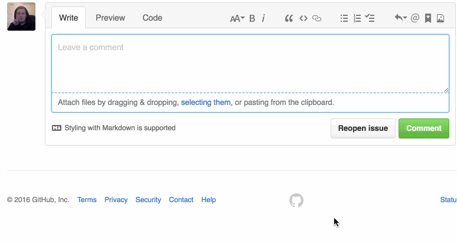

# OctoEdit

A Chrome Extension that adds a new tab to the comment edit area in GitHub, providing Markdown syntax highlighting and tabbing behavior.

_Huge_ thanks to [CodeMirror](https://codemirror.net/) and [Marijn Haverbeke](https://github.com/marijnh) for providing a free, MIT-licensed editor.

## Install

- [Chrome Store](https://chrome.google.com/webstore/detail/octoedit/ecnglinljpjkbgmdpeiglonddahpbkeb)

## Features

- Markdown syntax highlighting
- Syntax Highlighting for most popular languages within GFM fences
- Support for GitHub hotkey(`shift + meta + p`) to cycle through comment tabs

## Developing

1. Clone the repository
2. Run `npm run watch` to enable rebuilds on change
3. Load the `dist` folder as an [unpacked extension](https://developer.chrome.com/extensions/getstarted#unpacked) in Chrome

## Thank you to these contributors

- [James Talmage](https://github.com/jamestalmage)
